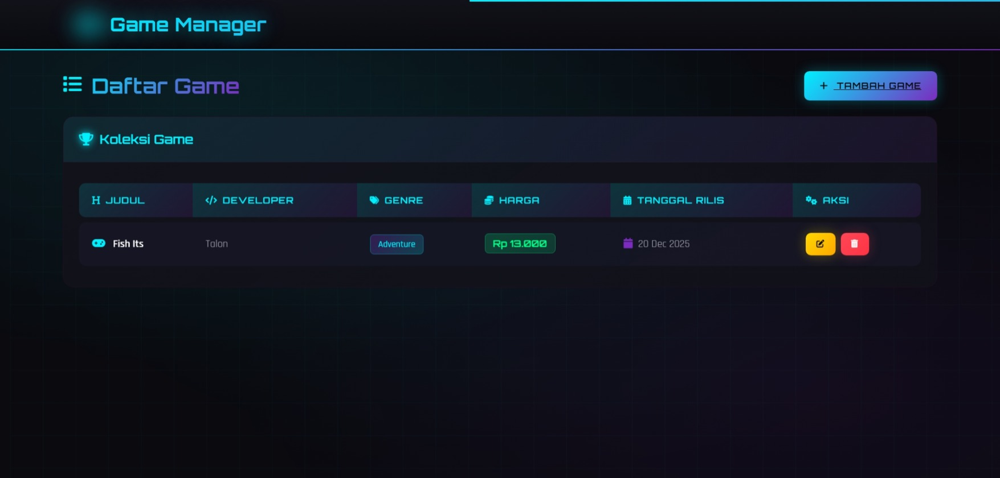

# 🎮 Game Manager - Modern Gaming Aesthetic App

Aplikasi manajemen game dengan desain **gaming aesthetic** yang modern, terinspirasi dari Steam dengan tema **neon biru-hitam yang elegan**, fitur interaktif lengkap, dan fully responsive untuk mobile.

<div align="center">


</div>

---

## ✨ Fitur Utama

### 🎨 **Design & UI**
- ✅ **Tema Gaming Neon** - Dark mode dengan accent neon biru & ungu
- ✅ **Animasi Smooth** - Transisi yang halus dan modern
- ✅ **Glow Effects** - Efek cahaya neon yang memukau
- ✅ **Scan Line Animation** - Efek futuristik di navbar
- ✅ **Gradient Backgrounds** - Gradient neon yang indah dan eye-catching
- ✅ **Grid Pattern Overlay** - Pola grid yang bergerak sebagai background

### 📱 **Responsive Design**
- ✅ **Fully Mobile Friendly** - Optimal di semua ukuran layar
- ✅ **Tablet Support** - Layout adaptif untuk tablet
- ✅ **Desktop Optimized** - Pengalaman terbaik di desktop
- ✅ **Landscape Mode** - Support orientasi landscape
- ✅ **Touch Friendly Buttons** - Ukuran optimal untuk sentuhan

### 🎬 **User Experience**
- ✅ **SweetAlert2 Integration** - Konfirmasi delete yang cantik
- ✅ **Auto-closing Notifications** - Notifikasi sukses otomatis
- ✅ **Card View Mobile** - Tabel berubah ke card pada mobile
- ✅ **Icon Integration** - Font Awesome icons di mana-mana
- ✅ **Loading States** - Feedback visual yang jelas

### 🔧 **Functionality**
- ✅ **CRUD Operations** - Create, Read, Update, Delete games
- ✅ **Database Driven** - Data disimpan di database
- ✅ **Form Validation** - Validasi input form
- ✅ **Date Formatting** - Format tanggal yang readable
- ✅ **Currency Display** - Format harga dengan rupiah

---

## 🚀 Tech Stack

- **Framework**: Laravel 11
- **Language**: PHP 8.2+
- **Frontend**: Bootstrap 5.3
- **Styling**: Custom CSS dengan CSS Variables
- **Fonts**: Orbitron (Gaming Font), Rajdhani
- **Icons**: Font Awesome 6.5
- **Alerts**: SweetAlert2
- **Database**: SQLite/MySQL

---

## 📋 Requirements

- PHP >= 8.2
- Composer
- Node.js & NPM (optional, untuk build assets)
- SQLite atau MySQL Database

---

## 🎯 Installation

### 1. Clone Repository
```bash
git clone <repository-url>
cd uts-phpfw-mi23
```

### 2. Install Dependencies
```bash
composer install
```

### 3. Setup Environment
```bash
cp .env.example .env
php artisan key:generate
```

### 4. Database Setup
```bash
php artisan migrate
php artisan db:seed (optional)
```

### 5. Run Application
```bash
php artisan serve
```

Aplikasi akan berjalan di `http://localhost:8000`

---

## 📖 Usage

### Menambah Game Baru
1. Klik tombol "**+ Tambah Game**" di halaman utama
2. Isi form dengan detail game:
   - Judul Game
   - Developer
   - Genre
   - Harga (Rp)
   - Tanggal Rilis
3. Klik "**Simpan Game**"

### Edit Game
1. Klik tombol **Edit** (icon pencil) pada game yang ingin diubah
2. Update informasi yang diperlukan
3. Klik "**Update Game**"

### Hapus Game
1. Klik tombol **Hapus** (icon trash) pada game
2. Konfirmasi hapus di SweetAlert modal
3. Game akan dihapus dari database

---

## 🎨 Color Palette

| Nama | Hex | Usage |
|------|-----|-------|
| Neon Blue | `#00f0ff` | Primary Color, Accents |
| Neon Purple | `#7b2cbf` | Secondary Color, Gradient |
| Dark BG | `#0a0a0f` | Background |
| Dark Card | `#12121a` | Card backgrounds |
| Dark Border | `#1e1e30` | Borders |
| Green Success | `#00ff88` | Success buttons |
| Yellow Warning | `#ffd700` | Warning buttons |
| Red Danger | `#ff4757` | Danger buttons |

---

## 📁 Project Structure

```
uts-phpfw-mi23/
├── app/
│   ├── Http/
│   │   └── Controllers/
│   │       └── GameController.php
│   └── Models/
│       └── Game.php
├── database/
│   ├── migrations/
│   └── seeders/
├── resources/
│   └── views/
│       ├── layouts/
│       │   └── app.blade.php (Main Layout dengan CSS)
│       └── games/
│           ├── index.blade.php (Daftar Games)
│           ├── create.blade.php (Tambah Game)
│           └── edit.blade.php (Edit Game)
├── routes/
│   └── web.php
└── public/
    └── index.php
```

---

## 🎯 Routes

| Method | URL | Controller | Action |
|--------|-----|------------|--------|
| GET | `/games` | GameController | index |
| GET | `/games/create` | GameController | create |
| POST | `/games` | GameController | store |
| GET | `/games/{id}/edit` | GameController | edit |
| PUT | `/games/{id}` | GameController | update |
| DELETE | `/games/{id}` | GameController | destroy |

---

## 🔒 Security

- ✅ CSRF Protection (Laravel middleware)
- ✅ SQL Injection Prevention (Eloquent ORM)
- ✅ XSS Protection (Blade templating)
- ✅ Route Model Binding

---

## 📱 Responsive Breakpoints

- **Desktop**: > 991px (Full layout)
- **Tablet**: 577px - 991px (Scaled layout)
- **Mobile**: ≤ 576px (Card view, full width)
- **Extra Small**: ≤ 360px (Optimized very small devices)
- **Landscape**: Height ≤ 600px (Landscape optimization)

---

## 🎬 Animation List

- **Fade-in** - Elemen masuk dengan fade
- **Slide-in** - Cards masuk dari kiri
- **Row Animation** - Baris tabel fade-in berurutan
- **Icon Pulse** - Icon berkedip dengan glow
- **Icon Float** - Icon naik turun
- **Background Pulse** - Background opacity berubah
- **Grid Move** - Grid pattern bergerak
- **Hover Effects** - Smooth hover transitions

---

## 🐛 Troubleshooting

### Database Error
```bash
php artisan migrate:refresh
```

### Cache Issues
```bash
php artisan cache:clear
php artisan config:clear
php artisan view:clear
```

### Assets Not Loading
```bash
php artisan route:clear
```

---

## 📝 Database Schema

### Games Table
```sql
CREATE TABLE games (
    id BIGINT PRIMARY KEY AUTO_INCREMENT,
    title VARCHAR(255) NOT NULL,
    developer VARCHAR(255) NOT NULL,
    genre VARCHAR(100) NOT NULL,
    price BIGINT NOT NULL,
    release_date DATE NOT NULL,
    created_at TIMESTAMP DEFAULT CURRENT_TIMESTAMP,
    updated_at TIMESTAMP DEFAULT CURRENT_TIMESTAMP ON UPDATE CURRENT_TIMESTAMP
);
```

---

## 👨‍💻 Author

Dikembangkan sebagai tugas UTS Pemrograman Web Framework dengan PHP (Laravel)

---

## 📄 License

Project ini menggunakan lisensi MIT. Silakan lihat file [LICENSE](LICENSE) untuk detail lebih lanjut.

---

## 🙏 Credits

- **Laravel Framework** - Web application framework
- **Bootstrap** - CSS framework
- **Font Awesome** - Icon library
- **SweetAlert2** - Beautiful alerts
- **Google Fonts** - Orbitron & Rajdhani fonts

---

## 💡 Tips & Tricks

### Custom CSS Variables
Edit file `resources/views/layouts/app.blade.php` untuk mengubah warna:

```css
:root {
    --neon-blue: #00f0ff;
    --neon-purple: #7b2cbf;
    --dark-bg: #0a0a0f;
}
```

### Menambah Game melalui Console
```php
Game::create([
    'title' => 'Game Title',
    'developer' => 'Developer',
    'genre' => 'Genre',
    'price' => 99000,
    'release_date' => '2025-12-20'
]);
```

---

## 🎮 Demo

Aplikasi ini menampilkan:
- ✅ Modern gaming UI dengan dark theme
- ✅ Responsive design untuk semua devices
- ✅ Smooth animations dan transitions
- ✅ Interactive notifications
- ✅ Professional game management system

---

**Happy Gaming! 🎮✨**

In order to ensure that the Laravel community is welcoming to all, please review and abide by the [Code of Conduct](https://laravel.com/docs/contributions#code-of-conduct).

## Security Vulnerabilities

If you discover a security vulnerability within Laravel, please send an e-mail to Taylor Otwell via [taylor@laravel.com](mailto:taylor@laravel.com). All security vulnerabilities will be promptly addressed.

## License

The Laravel framework is open-sourced software licensed under the [MIT license](https://opensource.org/licenses/MIT).

---

## Screenshots


